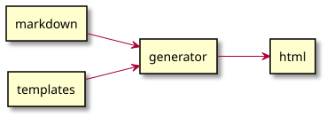
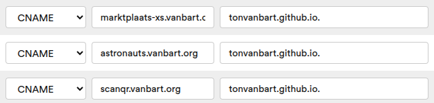
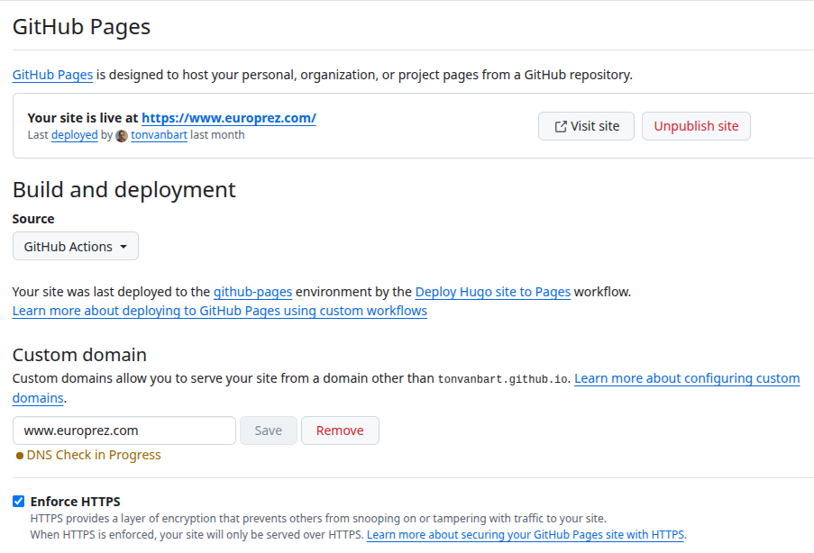
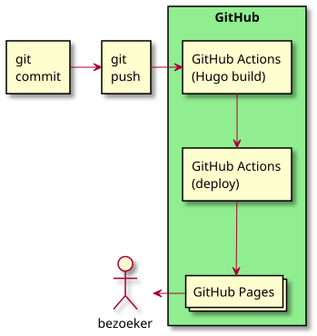
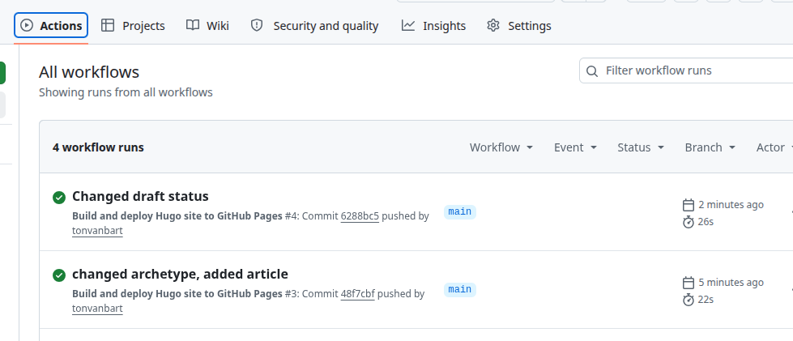

<!-- _class: lead -->
# van LAMP naar JAM
#### statische websites met Hugo 
#### gehost op GitHub
<!-- 
Waar gaat dit over: hosting van een plain 
html website op Github, en site generatie met Hugo dmv een Github workflow on demand,.

Dit is een vrij hardcore technisch verhaal!

Opzet berust op 3 pijlers: Hugo, Git, en Github: pages en actions. Over elk valt heel veel te vertellen maar daar is niet genoeg tijd voor.
Dit is een vrij hardcore technisch verhaal!

Verder zullen we kijken naar form handling. Ook 
hier 1 alternatief van vele.

Presentatie geeft een vogelvlucht van de onderwerpen!
-->

---
## Wie ben ik
* semi gepensioneerd software engineer
* OSS contributor [ksml.io](https://ksml.io) (in dienst, axual.com)

* [github.com/tonvanbart](github.com/tonvanbart)

<!-- 
Wie ik ben: semi gepensioneerd software engineer, AOW-er.
45 jaar engineering ervaring in allerlei rollen (system, network, software) 
nu nog 1 dag per week bij Axual.
Meest open source component: KSML.
Github profiel met mijn fork van KSML en mijn eigen open
source frutsels. Ook deze presentatie is daar te vinden plus
een compleet werkend voorbeeld (links op laatste slide).
-->

---
## Website hosting
* Veelal Wordpress
* Bekend platform: groot ecosysteem (plugins, themes)
* Hosting moet PHP en MySQL ondersteunen
  meer attack surface: bijhouden!
* Pagina's worden on demand gegenereerd: snelheid
* LAMP stack: Linux, Apache, MySQL, PHP


<!--
Website hosting: in veel gevallen: Wordpress. Niets mis mee, algemeen bekend, plugins, themes, ecosysteem.
Er zijn consequensties: LAMP stack, hosting moet MySQL en PHP hebben.
Onderhoud noodzakelijk (hacking!) hosting is duurder, of zelf doen.
Self hosting: idem, hou je thuisnetwerk veilig.
Omdat pagina's "on the fly" worden gegenereerd kan de site trager aanvoelen en zwaarder zijn voor de server.
Dit heet een LAMP stack: Linux, Apache, MySQL en een programmeertaal met een P (PHP, of Python/Perl)
-->

---
## Alternatief: statische websites
* plain HTML
* hosting kan goedkoop of gratis
* snel (geen on demand page generatie)
* minimaal attack surface
* ...onhandig

<!-- 
Statische websites zijn een goedkoop alterntief.  
Hosting is goedkoop
Sneller (geen paginageneratie)
Veilig(er)
Consequentie: hand coded HTML?
Niemand heeft zin om dat met de hand bij te houden 
(styling, templating enz)
Bv. aanpassing nav menu is veel handmatig werk 
op iedere pagina, aanpassing theme betekent alle
pagina's editen, enz.
-->

---
## Statische website generator
* Content tekst (markdown) plus templates
* Jekyll (Ruby), Pelican (Python), Eleventy (node), Hugo (Go)...



<!--
Een statische website generator kan zorgen voor uniforme 
layout, styling enz.
Content wordt geschreven in versimpelde markup (Markdown), 
de generator zorgt er voor dat de nodige pagina's (opnieuw)
worden gegenereerd mbv templating.
Er zijn veel verschillende open source statische website generators, geschreven in allerlei programmeertalen.
Jekyll, Pelican, Eleventy, Hugo, enz.
-->

---
<!-- _class: two-columns -->
## Markdown
<!--
De meeste site generators maken gebruik van Markdown.
Hiermee is de basis formatting eenvoudig weer te geven
(denk aan images, kopregels, lists en tables enz)
De site generator kan dit omzetten naar HTML.
Er is een specificatie van Markdown, zie de link.
-->
Lichtgewicht markup, simpele formatting
Zie [markdown.org](https://markdown.org)

```html
<h1>header level 1</h1>
<h2>level 2</h2>
<p>Paragraph tekst</p>
<p>Tweede paragraph</p>
<a href="http://www.example.com">hyperlink</a>

```

```markdown
# header level 1
## level 2
Paragraph tekst

Tweede paragraph
[hyperlink](http://www.example.com)


```
<!-- 
Hier zie je een voorbeeld van Markdown, en de HTML die er
uit gegenereerd wordt.
Gebruikt in bijv. Wikipedia, GitHub README en deze presentatie (Marp)!
-->
---
## Markdown: front matter
Metadata waar de generator iets mee kan:
```markdown
---
title: "Project kicked off"
date: 2026-08-01
summary: "The hugo-demo project is up and running."
---

We've started this demo project to show how easy it is to host a Hugo site
on GitHub Pages, deployed via GitHub Actions.
```
<!-- 
Frontmatter bevat metadata: gegevens over de pagina. Een site generator kan hier iets mee.
b.v. de post op een blogpagina voorzien van een datum, summary, titel zoals in dit voorbeeld.
Frontmatter is free format dus elk keyword kan. Zolang je template
het maar oppikt en er iets mee doet.
-->

---
## Waarom Hugo

* single binary
* geen dependencies om te installeren
* makkelijk in te zetten in publish automatisering

<!-- 
Waarom Hugo? Simpele install (1 executable), Golang templating die ik al een beetje kende.
Site bouw is snel (maakt voor kleine site niet uit overigens)
Hugo is geschreven in Go: single native binary, geen dependencies. Handige installatie zowel lokaal als in de CICD omgeving.
Dit wordt duidelijk als we naar Github Actions gaan kijken.
-->

---
## Hugo: directory structuur
```
my-project/
├── archetypes/
│   └── default.md
├── assets/
├── config/
│   └── _default/
│       └── hugo.toml
├── content/
├── data/
├── i18n/
├── layouts/
├── public/       <-- created when you build your project
├── resources/    <-- created when you build your project
├── static/
└── themes/
```
<!-- 
Hugo sites hebben een standaard directory structuur.
Archetypes: skelet van bv een blogpost.
hugo.toml is het config bestand voor hugo.
Onderhoud met commando's: `hugo new news/demo.md
Dit genereert een leeg basis Markdown document
op basis van het archetype.
Ook hier zie de Hugo docs voor meer informatie.
Demo hier?
-->
---
<!-- _class: lead -->
## Demo: Hugo 

<!-- 
Demo: `hugo server -D`, lokale site; edit content en live update.
-->
---
## Git
Git is: versiebeheer voor code; 
"Wie heeft wat wanneer gedaan, en waarom?"

* `git init`: breng deze folder onder versiebeheer
* `git add`: voeg deze file/wijziging toe aan de administratie
* `git commit`: leg deze wijziging(en) definitief vast

```shell
> git init
> git add nllgg-post.md
> git commit -m 'blogpost over nllgg toegevoegd'
```
<!-- 
We hebben nu een directory met site content waar we graag versie
beheer op willen.
Git in 2 minuten: hou de historie bij van een reeks van files in een directory (en subdirs).
De getoonde commando's geven de basis weer.
Git slaat de diff op, met de datum, gebruikersnaam en commit message.
Het is een "tijdmachine" voor je code, en net als in een SF
film kun je terug en alternatieve versies van de historie hebben: branches. Dit valt verder buiten het bestek van dit praatje.
-->

---
## Git remotes
Meerdere versies van een Git repo, op verschillende machines.
Hiermee kunnen ontwikkelaars samen werken aan een repo

* `git remote add {NAAM} {URL}`: voeg de remote op url {URL} toe als {NAAM}
* `git push {NAAM}`: stuur de lokale historie naar de remote
* `git pull {NAAM}`: haal de historie op uit de remote

<!-- 
Remotes zijn het mechanisme waarmee wordt samengewerkt aan een project; iedereen heeft zijn eigen versie van de repo.
Wijzigingen worden gedeeld dmv push/pull (pull request buiten het bestek van deze lezing)
- git remote add: voegt een remote toe
- git push: stuurt je (nieuwe) lokale historie naar de remote
- git pull: voegt de remote historie toe aan je lokale
Git is slim genoeg om conflicten te herkennen en op te lossen.
-->

---
## Github
Centrale plek om een remote op te slaan; gratis voor OSS.
Naast een Git remote biedt Github extra voorzieningen: project wiki, <span class="red">project websites</span>, issue tracking, <span class="red">CI/CD workflows</span>, en meer.
<p>

```shell
git remote add origin git@github.com:ownernaam/reponaam.git
```

<!-- 
Github als mechanisme om samen te werken: gecentraliseerde remote
Ontwikkelaars werken op hun eigen machine en delen hun werk 
via push/pull naar Github.
Daarnaast extra diensten als issue tracking, project wiki, project website, workflow automatisering.
Van deze gaan we de project website en workflows gebruiken.

Er zijn alternatieven met soortgelijke voorzieningen: Gitlab, of Gitea (OSS, evt self hosted) alternatief.
-->
---
## Github Pages
* website served vanuit een Github repo
* Gepubliceerd vanuit een branch, of vanuit een workflow 
* Standaard URL: https://usernaam.github.io/projectnaam 
* Ondersteunt HTTPS
* Custom domain is mogelijk

<!-- 
Github Pages is de hosting voor de website van je project.
Publish vanuit een workflow, of vanuit een branch 
(eerder genoemd, buiten scope v dit praatje)
standaard is URL gebaseerd op je project en gebruikernaam
kan HTTPS (heb je anders een cert voor nodig) 
kan custom domain
-->

---
## Github pages: custom domain
Dit vereist twee stappen:
1. Provider DNS: CNAME record verwijst naar github user
   
1. custom domein toevoegen in settings
  

<!-- 
Voor gebruik van een custom domein moet dit domein geregistreerd zijn (niet gratis dus, maar goedkoop)
Voeg bij de registrar een CNAME record toe dat alleen naar
de Github gebruiker verwijst: username.github.io. (let op de punt!)
In de Pages settings komt het custom domain.
-->
---
## Github Pages: settings



<!-- 
Voorbeeld van het Github Pages settings scherm.
deze is van een kleine website die ik ook op deze manier beheer (motorgroep)
DNS check in progress: wijzen de DNS servers ook naar Github?
Enforce HTTPS: alle http requests worden geredirect naar https.

-->

---
## Github Actions
* automatisering voor Continuous Integration/Delivery
* een of meer "jobs" met elk een of meer "steps"
* getriggerd door "events" in de repo als push, release
* ...of handmatig

<!-- 
Github Actions is de workflow automatisering.
Continuous Integration: het automatisch bouwen en testen van de code bij elke wijziging
Continous Delivery: het automatisch bouwen van het eindproduct

Een workflow bestaat uit een of meer jobs (b.v. bouw, test, creeer een zip met de output) en elke job bevat een of meer
steps (bv bouw = check de code uit, start de bouw, etc).
Een job heeft steps in volgorde. Jobs onderling kunnen
afhankelijkheid hebben OF eventueel parallel draaien.
Dit kunnen we gaan gebruiken voor het bouwen van de site.
-->

---
<!-- _class: two-columns -->
## Het plan


* `git push` start workflow
* job 1: bouw de site (Hugo)
* job 2: publish naar Pages
* profit/world domination

<!-- 
Het idee is: herbouw de Pages site elke keer dat een wijziging
naar Git wordt gepushed.
We gebruiken 2 jobs.
job 1 zet Hugo op de runner plus de site files en roept dan Hugo
aan om de site te bouwen. Daarna wordt het resultaat 
omgezet naar het formaat dan Pages verwacht.
job 2 is volgorde afhankelijk van job 1. Deze pakt het 
resultaat van job 1 op en deployt het naar Pages.

-->

---
## Github Actions trigger en build

```yaml
on:
  push:
    branches: [main]

jobs:
  build:
    runs-on: ubuntu-latest
    steps:
      - name: Setup Hugo
        uses: peaceiris/actions-hugo@v3

      - name: Build
        run: hugo --minify

      - name: Upload artifact
        uses: actions/upload-pages-artifact@v3

        (...)
```

<!-- 
Hier zie je het skelet van de workflow, details weggelaten.
Het eerste deel van de workflow definitie, versimpeld.
jobs draaien op runners (VM), we geven aan dat we een Ubuntu 
runner willen voor deze job.
1 job met meerdere stappen: 
- installeer Hugo op de runner
- genereer de site met Hugo
- zet het resultaat op een plek waar Pages het verwacht en in het juiste formaat.

Hier zie je waarom het handig is dat Hugo een single executable is; er zijn geen dependencies om te installeren.
Het resultaat belandt in ./public, en wordt ingepakt in
een formaat dat Pages verwacht (gzip met tar er in).
Opmerking: officiele limiet voor het artifact (zip) is 1Gb! 
-->
---
## Github Actions deploy
```yaml
jobs:

  (...)

  deploy:
    needs: build
    runs-on: ubuntu-latest
    steps:
      - name: Deploy to GitHub Pages
        uses: actions/deploy-pages@v4
```

<!-- 
De tweede job heeft eigenlijk maar 1 step: pak het 
artifact uit de vorige job en deploy het naar Pages.
Deze job is afhankelijk van het slagen van de "build" job, 
zie de "needs:" regel.
De actions zijn gestandaardiseerd, op te zoeken in documentatie.

feitelijk is de action een verwijzing naar een andere Github repo, je kunt dus de code van elke action inzien. 
-->
---
## Github Actions: status scherm



<!-- 
In de repo staat in het top menu een tab "Actions".
Hier zijn alle workflow runs te bekijken. 
Wat je ziet is informatie over de trigger van de workflow, 
tijdstip en duur van de workflow run, en de status (groen vinkje = OK)
-->
---
<!-- _class: lead -->
## Demo: git push en site herbouw

<!-- 
Demo: edit wat content, commit en push naar Github, en zie dat
de site aangepast is.
-->
---
## Wat te doen met... forms?
* geen server betekent geen form handling
* Google Form embed (lelijk!)
* op te lossen met serverless functie
* JAMstack: <span class="red">J</span>avascript, <span class="red">A</span>PIs, (statische) <span class="red">M</span>arkup

<!-- 
Geen server betekent dat we form handling moeten uitbestenden aan een (serverless) functie.

Je kunt Google Forms gebruiken en die embedden, gebruikt alleen 
zijn eigen styling (iframe). Niet mooi, maar simpel en werkt goed.

kan ook met serverless functie of form dienst: Voorbeelden Netlify Forms, Formspree, Google Apps Script...

Hier komt de term JAM stack vandaan:
Javascript, API, Markup als in statische markup.
-->
---
## Voorbeeld: Formspree
* Dienst om form submits te verwerken, free tier
* aanmelden met email
* validaties (niet getest)
* form data in dashboard

<!--
In deze presentatie: Formspree gratis account.
Dit is gelimiteerd tot 50 submits per maand.
-->

---
## TIMTOWTDI

* andere site generators
* andere hosting
* andere form oplossing
* WYSIWYG editing

<!-- 
There Is More Than One Way To Do It

Deze oplossing is 1 mogelijkheid, maar niet de enige.
Deploy kan ook naar Cloudflare, Amazon, Google Firebase, ...
De Actions workflow moet daar op aangepast worden.
De eerste job in de workflow blijft dan hetzelfde, alleen de tweede deploy job wordt anders.
Zie Hugo docs https://gohugo.io/host-and-deploy/ 
Je zou ook kunnen bouwen met een andere site 
generator, zie axual.github.io/ksml met mkdocs.
Alternatieve form oplossingen zijn Netlify Forms, Formspree en anderen.
Het basis idee blijft zoals hier beschreven.

In deze presentatie gebruik ik hand edited Markdown, er zijn
ook WYSIWYG editors, zie de Hugo documentatie.
Vb. Sveltium: Git based frontend voor Hugo, save is git push

-->
---
<!-- _class: lead -->

# Bedankt!

[github.com/tonvanbart/hugo-demo](github.com/tonvanbart/hugo-demo)
[hugo-demo.vanbart.org](hugo-demo.vanbart.org)

<!-- 
Bedankt voor het luisteren. Een compleet werkend voorbeeld is te
vinden op Github, deze kun je forken en er zelf mee aan de slag.
Het voorbeeld is gehost op eigen domein.
-->
---
<!-- _class: lead -->


<!-- 
vragen? 
-->
---